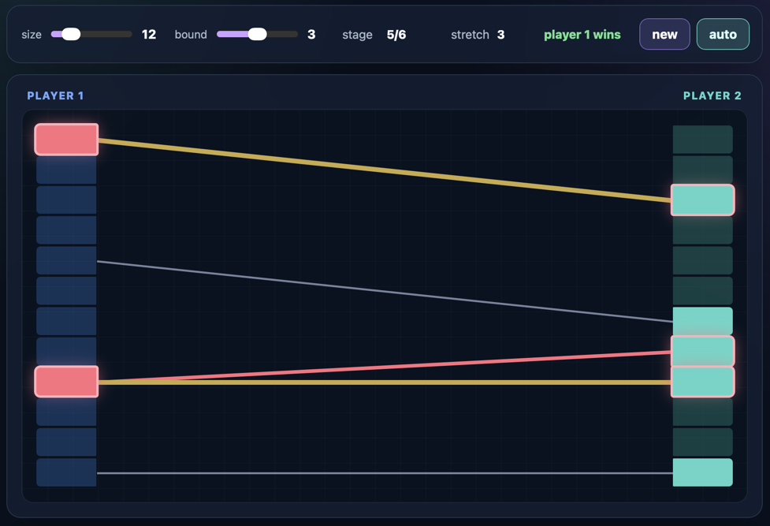

Two players create a bipartite graph between two sets of nodes of size N: 

- player 1 clicks any node on the left
- player 2 answers by clicking an unused node on the right. 
- player 1 may reuse left-nodes, but Player 2 may never reuse a right-node. 
- a parameter k sets the difficulty of player 1 winning the game. 

A set R of k many right-nodes is a **k-stretch** if r< m where

- r is the distance between the smallest and largest node in R
- L is the set of left-nodes that have edges with nodes in R
- m is the minimum distance amongst any pair of distinct nodes in L.

Player 1 wins as soon as the there is a k-stretch in the graph within N/2 completed stages, In this case: 

- the nodes exhibiting a k-stretch are highlighted by a red border (call them "red nodes")  
- yellow edges connect two consecutive red nodes on the left with the smallest and largest red-node on the right

so that the yellow edges from left to right approach each other (this witnesses a k-stretch).

