# Stretch

Stretch is a two-player game on a bipartite graph. 

## How to play

Two players create a bipartite graph between two sets of nodes of size N: 

- player 1 clicks any node on the left
- player 2 answers by clicking an unused node on the right. 
- player 1 may reuse left-nodes, but Player 2 may never reuse a right-node. 
- a parameter k sets the difficulty of player 1 winning the game. 

A set R of k many right-nodes is a **k-stretch** if r< m where

- r is the distance between the smallest and largest node in R
- L is the set of left-nodes that have edges with nodes in R
- m is the minimum distance amongst any pair of distinct nodes in L.

Player 1 wins as soon as the there is a k-stretch in the graph within N/2 completed stages, In this case: 

- the nodes exhibiting a k-stretch are highlighted by a red border (call them "red nodes")  
- yellow edges connect two consecutive red nodes on the left with the smallest and largest red-node on the right

so that the yellow edges from left to right approach each other (this witnesses a k-stretch).

## Controls

| Control | Action |
| --- | --- |
| **size** slider | Set the number of nodes on each side (`N`), from 4 to 50 in steps of 2. Changing it starts a new game. |
| **bound** slider | Set the target stretch size (`k`), from 2 to 4. Changing it starts a new game. |
| **new** | Start a new game with the current size and bound. |
| **auto** | Start a new game with Player 1 picking automatically; Player 2 still picks manually. |
| **loop** | Start a game with both players picking randomly. Click **pause** to stop it temporarily and **loop** to resume. |
| **svg** | Download an SVG of the current display. |
| **asvg** | Download an animated SVG replay of the recorded loop moves. Available after a loop has made at least one move. |

